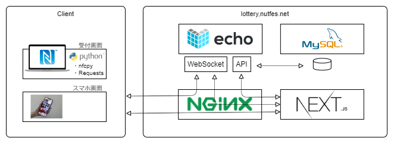

# 学籍番号抽選会アプリ

Raspberry Pi と NFC 端末で学生証を読み取り，学籍番号を用いて抽選を行うシステム

抽選は会場で行うが，WebSocket によってスマホでの確認も可能

## 背景

## 構成



## 今後の展望

---

## 開発手順

### 1. クローン

```bash
git clone git@github.com:NUTFes/lottery.git
```

### 2. ビルド

```bash
# ビルド
docker compose build
docker compose run --rm api poetry install
docker compose run --rm app npm install
docker compose run --rm nfc poetry install

# lottery.dbがあれば，削除
sudo rm api/lottery.db
# テーブル作成
docker compose run --rm api python create_table.py

# 立ち上げ
docker compose up
```

### 3. 開発

issue に応じて，`dev/<issue番号>`でブランチを切ってそのブランチで開発してください

```bash
# 例
git switch -c dev/issue123
```

### 4. add, commit, push

- コミットはコミットメッセージの書式に従ってください。
- プッシュは今いるブランチと同じ名前の場所にプッシュしてください。

```bash
# add
git add <file_name or directory_name>

# commit
git commit -m "<commit message>"

# push
git push origin <branch名>
```

#### commit メッセージの書式

- ファイルを追加したとき
  `git commit -m "[add] 内容 (#<issue番号>)"`
- ファイルを変更したとき
  `git commit -m "[mod] 内容 (#<issue番号>)"`
- ファイルを削除したとき
  `git commit -m "[del] 内容 (#<issue番号>)"`
- 例
  `git commit -m "[mod] 学籍番号の送信書式をJSONに変更 (#12)"`

### 5. Pull Request
- 確認してほしい点を明記してプルリクを書いてください 

### 6. ER図


